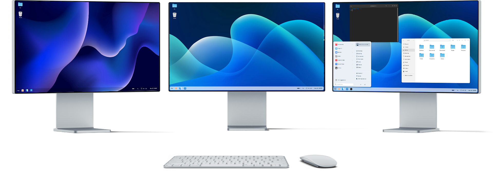
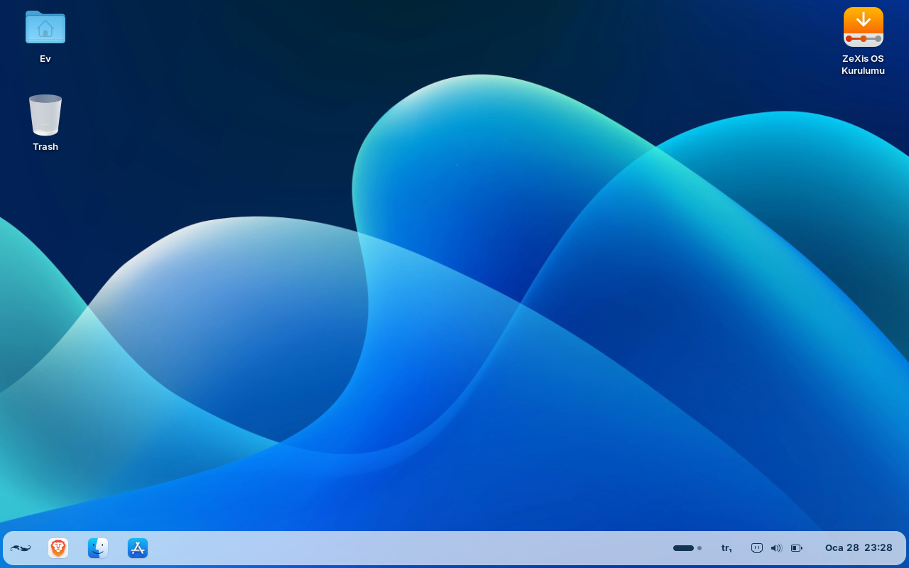
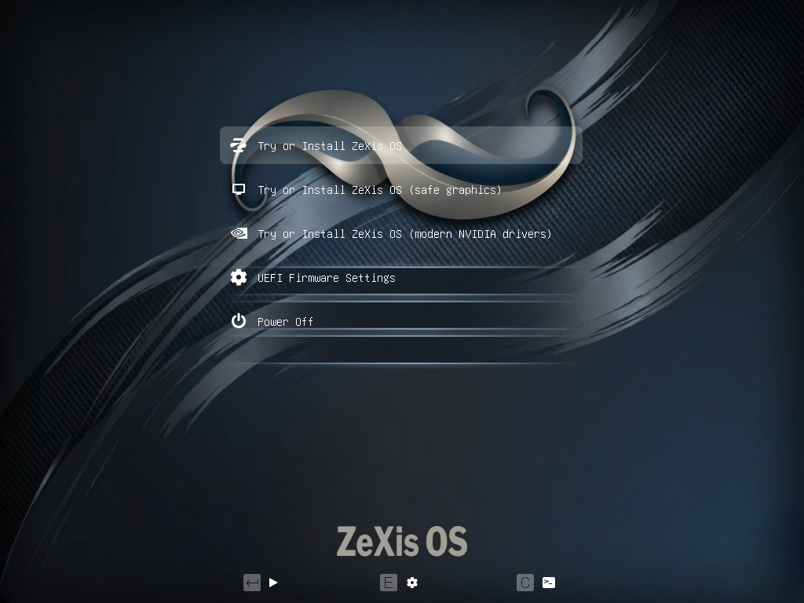
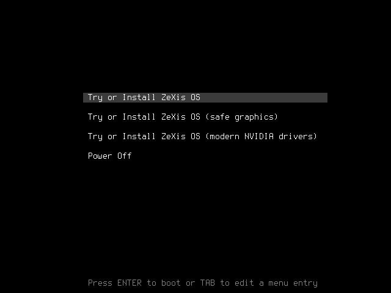
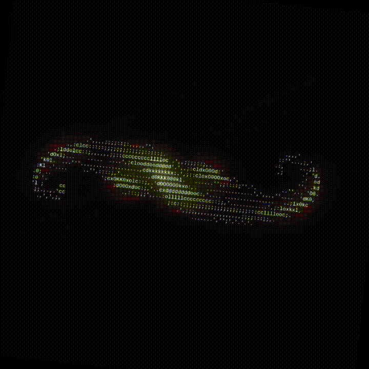

# ZeXis OS
An open-source operating system based on **Zorin OS** designed for efficiency and customization.

## Features
- **User-friendly interface**: Intuitive design for both beginners and advanced users.
- **Lightweight**: Optimized for performance on older hardware.
- **Customizable**: Extensive options for personalizing the desktop environment.
- **Pre-installed applications**: Comes with essential software for productivity and entertainment.
- **Regular updates**: Frequent updates to ensure security and add new features.

## Desktop

> This is the live desktop of ZeXis OS v0.0.2. You can see the default wallpaper, taskbar, and some pre-installed applications.

## Using themes

<a href="https://github.com/vinceliuice/WhiteSur-icon-theme" target="_blank">
  
  <strong>WhiteSur Icon Theme</strong>
</a>

 

<a href="https://github.com/vinceliuice/WhiteSur-gtk-theme" target="_blank">
  
  <strong>WhiteSur GTK Theme</strong>
</a>

## Installation

To install ZeXis OS, follow these steps:

1. Download the latest ISO or its torrent from the [Releases](https://github.com/YusufErdemK/zexis/releases) page.
2. If you downloaded the torrent, open it with qBittorrent or any torrent client of your choice to download the ISO.
3. Create a bootable USB drive using a tool such as Rufus or Etcher.
4. Boot your computer or virtual machine from the USB drive and follow the on-screen instructions to install ZeXis OS.

## Boot options

### UEFI

You can boot and edit the boot options in UEFI mode as shown above.

### Legacy BIOS

You can boot and edit the boot options in Legacy BIOS mode as shown above.

Notes:
- If you want to see boot messages, you can remove the `quiet splash` options from the kernel boot line.
- Zorin OS includes an ISO checker by default that verifies the integrity of the ISO before booting. To skip the ISO check while it is running, press `Ctrl+C`.

## Target boot animation

  

## Social media

- [Instagram](https://instagram.com/zexislinux)

## Plans for the future

- Develop a custom ZeXis OS installer.
- Create a dedicated website for ZeXis OS.
- Expand social media presence.
- Build a community around ZeXis OS for support and collaboration.

## Author

- **Yusuf Erdem K.** — [GitHub Profile](https://github.com/YusufErdemK)

## License

ZeXis OS is released under the MIT License. See the [LICENSE](./LICENSE) file for details.

> I hope you like ZeXis OS! If you have any questions or suggestions, feel free to reach out.